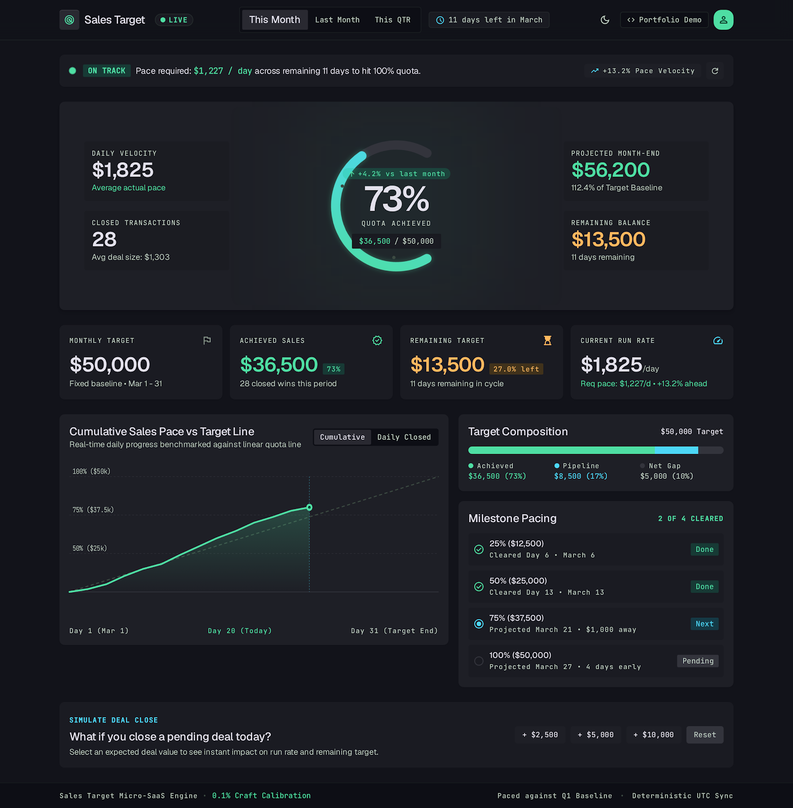

# Sales Target Dashboard

A production-grade sales quota tracking dashboard built with plain HTML, CSS, and JavaScript — no frameworks, no build step. Track monthly/quarterly attainment, pacing velocity, milestone progress, and run instant "what-if" deal simulations.



## Features

- **Live quota gauge** — circular attainment meter with gradient fill and pacing delta
- **Period switching** — This Month / Last Month / This QTR, each with its own dataset
- **Cumulative pace chart** — SVG trend line vs. a linear target baseline, with a live hover tooltip and crosshair showing interpolated value and variance vs. target pace
- **Target composition** — stacked bar breakdown of achieved / pipeline / gap
- **Milestone pacing** — 25/50/75/100% checkpoints with cleared/next/pending states
- **Deal simulator** — instantly preview the impact of closing a $2.5k / $5k / $10k deal on run rate and remaining target
- **Light & dark themes** — toggle persists via `localStorage` and respects the OS `prefers-color-scheme` on first visit, with no flash of the wrong theme on load
- **Animated metrics** — key numbers count up/down smoothly on period switches and simulations (respects `prefers-reduced-motion`)
- **Fully responsive** — desktop, tablet, and mobile layouts down to 320px wide

## Tech stack

- HTML5 + CSS3 (custom properties for theming, CSS Grid/Flexbox layout)
- Vanilla JavaScript (no dependencies, no build tooling)
- Hand-tuned inline SVG for the gauge and trend chart

## Getting started

No build step required — it's static HTML/CSS/JS.

```bash
# Option 1: just open it
open index.html

# Option 2: serve it locally (recommended, avoids browser file:// restrictions)
python -m http.server 4173
# then visit http://localhost:4173
```

## Project structure

```
index.html      # Markup and page structure
styles.css      # Theming (light/dark), layout, responsive breakpoints
app.js          # Dataset, rendering, chart interactivity, theme + animation logic
```

## Design credit

Visual design based on the "Precision Metric Vanguard" design system (see `.design/DESIGN.md` for full spec).
